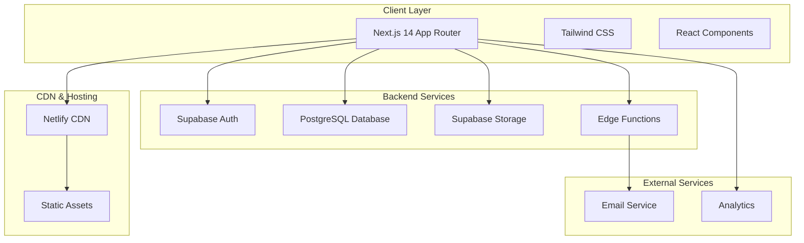
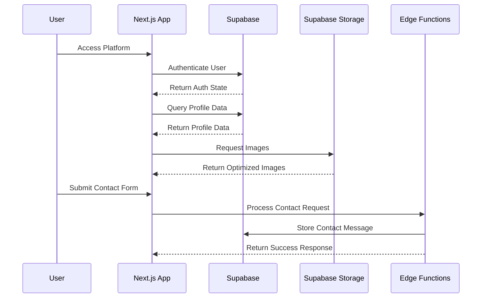

# Design Document

## Overview

Project Lens is a vertical professional network built as a Single Page Application (SPA) using Jamstack architecture. The platform connects visual production industry professionals through a clean, minimalist interface that prioritizes visual content and professional networking. The design emphasizes performance, scalability, and SEO optimization while providing role-specific functionality for photographers, models, makeup artists, stylists, and producers.

The system follows a "content is king" philosophy, showcasing visual portfolios through an elegant, clean, and functional interface optimized for both mobile and desktop experiences. The MVP focuses on core functionality including user registration with role-specific profiles, comprehensive search and filtering capabilities, portfolio management, and secure contact messaging, with a strong emphasis on performance optimization and SEO.

## Architecture

### High-Level Architecture



### Technology Stack

**Frontend:**

- Next.js 14 with App Router for modern development, SSR/SSG support, and robust SEO
- React 18 with Server and Client Components
- Tailwind CSS for rapid, consistent, and responsive design
- TypeScript for type safety and better developer experience

**Backend & Database:**

- Supabase as Backend-as-a-Service providing:
  - PostgreSQL managed database for structured data
  - Integrated authentication with email/OAuth support
  - File storage for images with optimization
  - Edge Functions for custom business logic
  - Row-Level Security (RLS) for data protection

**Hosting & Deployment:**

- Netlify for automatic deployments, global CDN, and serverless functions
- Vercel Analytics for traffic and performance monitoring

### Data Flow Architecture



## Components and Interfaces

### Core Components Architecture

**Layout Components:**

- `RootLayout`: Global layout with navigation and footer
- `Navbar`: Responsive navigation with mobile hamburger menu
- `Footer`: Site-wide footer with links and social media
- `MobileMenu`: Collapsible mobile navigation

**Page Components:**

- `HomePage`: Landing page with hero section and featured profiles
- `SearchPage`: Search interface with filters and results grid
- `ProfilePage`: Individual profile display with portfolio
- `ProfileEditPage`: Profile editing form with role-specific fields
- `AuthPages`: Login and registration forms

**Feature Components:**

- `ProfileCard`: Reusable profile preview card for search results
- `PortfolioGrid`: Masonry grid layout for portfolio images
- `ContactModal`: Modal form for contacting professionals
- `SearchFilters`: Dynamic filter sidebar for search functionality
- `ImageUpload`: File upload component with validation and preview

**UI Components:**

- `Button`: Consistent button styling with variants
- `Input`: Form input components with validation
- `Modal`: Reusable modal container
- `LoadingSpinner`: Loading state indicators
- `ErrorBoundary`: Error handling and display

### API Interface Design

**Authentication Endpoints:**

```typescript
interface AuthAPI {
  signUp(
    email: string,
    password: string,
    userData: UserData
  ): Promise<AuthResponse>
  signIn(email: string, password: string): Promise<AuthResponse>
  signOut(): Promise<void>
  resetPassword(email: string): Promise<void>
}
```

**Profile Management:**

```typescript
interface ProfileAPI {
  getProfile(username: string): Promise<Profile>
  updateProfile(id: string, data: ProfileData): Promise<Profile>
  uploadImage(
    file: File,
    type: 'avatar' | 'cover' | 'portfolio'
  ): Promise<string>
  deletePortfolioImage(imageId: string): Promise<void>
}
```

**Search and Discovery:**

```typescript
interface SearchAPI {
  searchProfiles(
    filters: SearchFilters,
    pagination: Pagination
  ): Promise<SearchResults>
  getFeaturedProfiles(limit: number): Promise<Profile[]>
  getProfilesByRole(role: UserRole): Promise<Profile[]>
}
```

**Contact System:**

```typescript
interface ContactAPI {
  sendMessage(
    senderId: string,
    receiverId: string,
    message: ContactMessage
  ): Promise<void>
  getContactHistory(userId: string): Promise<ContactMessage[]>
}
```

## Data Models

### Core Data Structures

**User Profile Model:**

```typescript
interface Profile {
  id: string
  username: string
  full_name: string
  role: 'photographer' | 'model' | 'stylist' | 'makeup_artist' | 'producer'
  bio: string
  location: string
  avatar_url?: string
  cover_image_url?: string
  subscription_tier: 'free' | 'pro'
  role_specific_data: RoleSpecificData
  portfolio_images: PortfolioImage[]
  created_at: Date
  updated_at: Date
}
```

**Role-Specific Data Models:**

```typescript
interface ModelData {
  model_type: string[]
  experience_level: string
  height_cm: number
  measurements: {
    bust_cm: number
    waist_cm: number
    hips_cm: number
  }
  shoe_size_eu: number
  dress_size_eu: number
  hair_color: string
  eye_color: string
  special_attributes: {
    tattoos: boolean
    piercings: boolean
  }
}

interface PhotographerData {
  specialties: string[]
  experience_level: string
  studio_access: string
  equipment_highlights: string
  post_production_skills: string[]
}

interface MakeupArtistData {
  specialties: string[]
  experience_level: string
  kit_highlights: string[]
  services_offered: string[]
  travel_availability: boolean
}

interface StylistData {
  specialties: string[]
  experience_level: string
  industry_focus: string[]
  wardrobe_access: string
  portfolio_url?: string
}

interface ProducerData {
  specialties: string[]
  services: string[]
  typical_budget_range: string
  portfolio_url?: string
}
```

**Contact Message Model:**

```typescript
interface ContactMessage {
  id: string
  sender_id: string
  receiver_id: string
  subject: string
  message: string
  created_at: Date
}
```

### Database Schema Design

**PostgreSQL Tables:**

```sql
-- Profiles table (extends Supabase auth.users)
CREATE TABLE profiles (
  id UUID REFERENCES auth.users(id) PRIMARY KEY,
  username TEXT UNIQUE NOT NULL,
  full_name TEXT NOT NULL,
  role user_role NOT NULL,
  bio TEXT CHECK (char_length(bio) <= 500),
  location TEXT NOT NULL,
  avatar_url TEXT,
  cover_image_url TEXT,
  subscription_tier subscription_tier DEFAULT 'free',
  role_specific_data JSONB,
  created_at TIMESTAMP WITH TIME ZONE DEFAULT NOW(),
  updated_at TIMESTAMP WITH TIME ZONE DEFAULT NOW()
);

-- Portfolio images table
CREATE TABLE portfolio_images (
  id UUID DEFAULT gen_random_uuid() PRIMARY KEY,
  profile_id UUID REFERENCES profiles(id) ON DELETE CASCADE,
  image_url TEXT NOT NULL,
  alt_text TEXT,
  sort_order INTEGER,
  created_at TIMESTAMP WITH TIME ZONE DEFAULT NOW()
);

-- Contact messages table
CREATE TABLE contacts (
  id UUID DEFAULT gen_random_uuid() PRIMARY KEY,
  sender_id UUID REFERENCES profiles(id) ON DELETE CASCADE,
  receiver_id UUID REFERENCES profiles(id) ON DELETE CASCADE,
  subject TEXT CHECK (char_length(subject) <= 100) NOT NULL,
  message TEXT CHECK (char_length(message) <= 1000) NOT NULL,
  created_at TIMESTAMP WITH TIME ZONE DEFAULT NOW()
);

-- Indexes for performance
CREATE INDEX idx_profiles_username ON profiles(username);
CREATE INDEX idx_profiles_role ON profiles(role);
CREATE INDEX idx_profiles_location ON profiles(location);
CREATE INDEX idx_profiles_role_specific_data ON profiles USING GIN(role_specific_data);
CREATE INDEX idx_portfolio_images_profile_id ON portfolio_images(profile_id);
CREATE INDEX idx_contacts_receiver_id ON contacts(receiver_id);
```

## Error Handling

### Error Handling Strategy

**Client-Side Error Handling:**

- React Error Boundaries for component-level error catching
- Form validation with real-time feedback
- Network error handling with retry mechanisms
- User-friendly error messages with actionable guidance

**Server-Side Error Handling:**

- Supabase RLS policies for authorization errors
- Edge Function error handling with proper HTTP status codes
- Database constraint violations with meaningful error messages
- File upload error handling with size and format validation

**Error Types and Responses:**

```typescript
interface ErrorResponse {
  error: {
    code: string
    message: string
    details?: any
  }
}

// Common error codes
enum ErrorCodes {
  VALIDATION_ERROR = 'VALIDATION_ERROR',
  AUTHENTICATION_ERROR = 'AUTHENTICATION_ERROR',
  AUTHORIZATION_ERROR = 'AUTHORIZATION_ERROR',
  NOT_FOUND = 'NOT_FOUND',
  RATE_LIMIT_EXCEEDED = 'RATE_LIMIT_EXCEEDED',
  FILE_TOO_LARGE = 'FILE_TOO_LARGE',
  INVALID_FILE_TYPE = 'INVALID_FILE_TYPE',
}
```

**Error Handling Components:**

- `ErrorBoundary`: Catches and displays React component errors
- `ErrorMessage`: Displays form and API errors
- `NotFound`: 404 error page component
- `ServerError`: 500 error page component

## Testing Strategy

### Testing Approach

**Unit Testing:**

- Jest and React Testing Library for component testing
- Test utilities and custom hooks
- Mock Supabase client for isolated testing
- Coverage targets: 80% for critical components

**Integration Testing:**

- End-to-end user flows with Playwright
- API integration testing with real Supabase instance
- Image upload and processing workflows
- Authentication and authorization flows

**Performance Testing:**

- Lighthouse CI for performance monitoring
- Core Web Vitals tracking
- Image optimization validation
- Bundle size monitoring

**Testing Structure:**

```
tests/
├── __mocks__/           # Mock implementations
├── components/          # Component unit tests
├── pages/              # Page integration tests
├── utils/              # Utility function tests
├── e2e/                # End-to-end tests
└── setup/              # Test configuration
```

### Quality Assurance

**Code Quality:**

- ESLint and Prettier for code formatting
- TypeScript strict mode for type safety
- Husky pre-commit hooks for quality gates
- SonarQube for code quality analysis

**Accessibility Testing:**

- axe-core for automated accessibility testing
- Manual keyboard navigation testing
- Screen reader compatibility testing
- WCAG 2.1 AA compliance validation

**Security Testing:**

- Supabase RLS policy testing
- Input sanitization validation
- File upload security testing
- Authentication flow security review

## SEO and Performance Optimization

### SEO Implementation

**Technical SEO:**

- Next.js App Router for optimal SSR/SSG
- Dynamic meta tags generation
- Clean URL structure: `/{username}`
- XML sitemap generation and updates
- Robots.txt configuration

**Structured Data:**

```typescript
// Schema.org Person markup for profiles
const personSchema = {
  '@context': 'https://schema.org',
  '@type': 'Person',
  name: profile.full_name,
  jobTitle: profile.role,
  description: profile.bio,
  image: profile.avatar_url,
  url: `https://projectlens.com/${profile.username}`,
}
```

**Performance Optimization:**

- Next.js Image component for automatic optimization
- Lazy loading for portfolio images
- Code splitting with dynamic imports
- Static generation for public pages
- CDN delivery through Netlify

**Core Web Vitals Targets:**

- Largest Contentful Paint (LCP): < 2.5s
- First Input Delay (FID): < 100ms
- Cumulative Layout Shift (CLS): < 0.1

### Responsive Design System

**Breakpoint Strategy:**

```css
/* Tailwind CSS breakpoints */
sm: 640px   /* Small devices */
md: 768px   /* Medium devices */
lg: 1024px  /* Large devices */
xl: 1280px  /* Extra large devices */
2xl: 1536px /* 2X large devices */
```

**Component Responsiveness:**

- Mobile-first design approach
- Flexible grid systems using CSS Grid and Flexbox
- Responsive typography scaling
- Touch-friendly interface elements
- Progressive enhancement for advanced features

This design provides a solid foundation for building a scalable, performant, and user-friendly professional network platform that meets all the specified requirements while maintaining flexibility for future enhancements.
