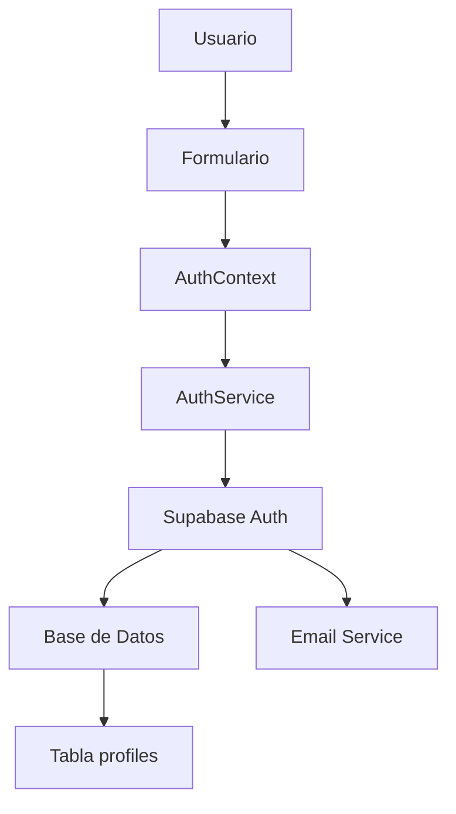

# Flujo de Autenticación - Project Lens

## Descripción General

Project Lens utiliza Supabase Auth para manejar la autenticación de usuarios, proporcionando un sistema seguro y escalable que incluye registro, inicio de sesión, verificación de email y recuperación de contraseña.

## Arquitectura de Autenticación

### Componentes Principales

1. **AuthService** (`src/lib/auth.ts`): Servicio principal que maneja todas las operaciones de autenticación
2. **AuthContext** (`src/contexts/AuthContext.tsx`): Context de React para el estado global de autenticación
3. **Middleware** (`src/middleware.ts`): Protección de rutas y redirecciones automáticas
4. **Formularios de Autenticación**: Componentes UI para login, registro y recuperación

### Flujo de Datos



## Funcionalidades Implementadas

### 1. Registro de Usuario

**Endpoint**: `POST /auth/signup` (Supabase)
**Componente**: `RegistrationForm`
**Página**: `/registro`

#### Proceso:
1. Usuario completa formulario con email, contraseña, username, nombre completo y rol
2. Validación en tiempo real de todos los campos
3. Verificación de disponibilidad de username
4. Creación de cuenta en Supabase Auth
5. Creación de perfil en tabla `profiles`
6. Envío de email de verificación
7. Redirección a página de confirmación

#### Validaciones:
- Email válido y único
- Contraseña mínimo 8 caracteres con letras y números
- Username único, 3-20 caracteres, solo letras, números y guiones bajos
- Nombre completo mínimo 2 caracteres
- Rol seleccionado obligatorio

### 2. Inicio de Sesión

**Endpoint**: `POST /auth/signin` (Supabase)
**Componente**: `LoginForm`
**Página**: `/login`

#### Proceso:
1. Usuario ingresa email y contraseña
2. Validación de campos
3. Autenticación con Supabase
4. Obtención de datos de perfil
5. Actualización del estado global
6. Redirección a página principal o destino previsto

#### Características:
- Opción "Recordar sesión"
- Enlace a recuperación de contraseña
- Mensajes de error específicos en español
- Soporte para login social (Google) - UI preparada

### 3. Recuperación de Contraseña

**Endpoints**: 
- `POST /auth/reset` (solicitud)
- `POST /auth/update` (actualización)

**Componente**: `PasswordRecoveryForm`
**Página**: `/recuperar-password`

#### Proceso de Solicitud:
1. Usuario ingresa email
2. Envío de email con enlace de recuperación
3. Confirmación de envío

#### Proceso de Reset:
1. Usuario accede desde enlace en email
2. Formulario para nueva contraseña
3. Validación de contraseña segura
4. Actualización en Supabase
5. Redirección a login con mensaje de éxito

### 4. Verificación de Email

**Automático**: Supabase maneja el proceso
**Configuración**: Redirect URL configurada en Supabase Dashboard

#### Proceso:
1. Usuario recibe email de verificación al registrarse
2. Click en enlace activa la cuenta
3. Redirección automática a la aplicación
4. Usuario puede iniciar sesión normalmente

### 5. Gestión de Sesión

**Context**: `AuthContext`
**Hook**: `useAuth()`

#### Estado Global:
- `user`: Datos del usuario autenticado o `null`
- `loading`: Estado de carga de operaciones auth
- Métodos: `signIn`, `signUp`, `signOut`, `resetPassword`, etc.

#### Persistencia:
- Sesiones persistidas automáticamente por Supabase
- Refresh automático de tokens
- Detección de cambios de estado de auth

## Protección de Rutas

### Middleware de Autenticación

**Archivo**: `src/middleware.ts`

#### Rutas Protegidas:
- `/perfil/*` - Requiere autenticación
- `/mensajes/*` - Requiere autenticación

#### Rutas de Auth:
- `/login` - Redirige a home si ya está autenticado
- `/registro` - Redirige a home si ya está autenticado
- `/recuperar-password` - Redirige a home si ya está autenticado

#### Comportamiento:
- Redirección automática a `/login` con parámetro `redirect` para rutas protegidas
- Redirección a home para usuarios autenticados en rutas de auth
- Preservación de la URL de destino para después del login

## Configuración de Supabase

### Variables de Entorno Requeridas

```env
NEXT_PUBLIC_SUPABASE_URL=https://your-project.supabase.co
NEXT_PUBLIC_SUPABASE_PUBLISHABLE_DEFAULT_KEY=your-anon-key
SUPABASE_SERVICE_ROLE_KEY=your-service-role-key
```

### Configuración de Auth en Supabase Dashboard

1. **Email Templates**: Personalizados en español
2. **Redirect URLs**: 
   - `http://localhost:3000/recuperar-password` (desarrollo)
   - `https://projectlens.com/recuperar-password` (producción)
3. **Email Rate Limiting**: Configurado para prevenir spam
4. **Password Policy**: Mínimo 6 caracteres (validación adicional en frontend)

### Políticas RLS (Row Level Security)

```sql
-- Política para perfiles - usuarios solo pueden ver/editar su propio perfil
CREATE POLICY "Users can view own profile" ON profiles
  FOR SELECT USING (auth.uid() = id);

CREATE POLICY "Users can update own profile" ON profiles
  FOR UPDATE USING (auth.uid() = id);

-- Política para perfiles públicos - todos pueden ver perfiles de otros
CREATE POLICY "Public profiles are viewable by everyone" ON profiles
  FOR SELECT USING (true);
```

## Manejo de Errores

### Errores Comunes y Mensajes

| Error de Supabase | Mensaje al Usuario |
|-------------------|-------------------|
| `Invalid login credentials` | Email o contraseña incorrectos |
| `Email not confirmed` | Debes confirmar tu email antes de iniciar sesión |
| `User already registered` | Ya existe una cuenta con este email |
| `Email rate limit exceeded` | Has enviado demasiados emails. Espera unos minutos. |

### Estrategia de Manejo:
1. Captura de errores en `AuthService`
2. Traducción a mensajes en español
3. Propagación a componentes UI
4. Visualización user-friendly en formularios

## Testing

### Casos de Prueba Implementados

1. **Registro exitoso** con todos los campos válidos
2. **Validación de campos** en tiempo real
3. **Verificación de username** disponible/no disponible
4. **Login exitoso** con credenciales válidas
5. **Manejo de errores** de autenticación
6. **Recuperación de contraseña** flujo completo
7. **Protección de rutas** middleware

### Datos de Prueba

```javascript
// Usuario de prueba para desarrollo
const testUser = {
  email: 'test@projectlens.dev',
  password: 'password123',
  username: 'testuser',
  full_name: 'Usuario de Prueba',
  role: 'photographer'
}
```

## Seguridad

### Medidas Implementadas

1. **Validación Client-Side**: Prevención de datos inválidos
2. **Validación Server-Side**: Supabase valida todos los datos
3. **Rate Limiting**: Prevención de spam en emails
4. **RLS Policies**: Control de acceso a nivel de base de datos
5. **HTTPS**: Todas las comunicaciones encriptadas
6. **JWT Tokens**: Autenticación segura con tokens
7. **Password Hashing**: Supabase maneja el hashing seguro

### Consideraciones de Seguridad

- Nunca exponer service role key en frontend
- Validar siempre datos en servidor
- Usar políticas RLS para control de acceso
- Implementar rate limiting en operaciones sensibles
- Logs de seguridad para auditoría

## Próximas Mejoras

### Funcionalidades Planificadas

1. **Login Social**: Google, Facebook, GitHub
2. **2FA**: Autenticación de dos factores
3. **Session Management**: Control de sesiones activas
4. **Account Deletion**: Eliminación de cuenta
5. **Email Change**: Cambio de email con verificación
6. **Admin Panel**: Gestión de usuarios para administradores

### Optimizaciones

1. **Caching**: Cache de datos de usuario
2. **Offline Support**: Funcionalidad offline básica
3. **Performance**: Optimización de queries
4. **Monitoring**: Métricas de autenticación
5. **Analytics**: Tracking de eventos de auth

## Troubleshooting

### Problemas Comunes

1. **Email no llega**: Verificar configuración SMTP en Supabase
2. **Redirect loops**: Verificar configuración de middleware
3. **Session expired**: Implementar refresh automático
4. **CORS errors**: Configurar dominios permitidos en Supabase

### Logs y Debugging

- Logs de Supabase Auth en dashboard
- Console logs en desarrollo para debugging
- Error tracking con Sentry (configurado)
- Performance monitoring con Vercel Analytics

## Conclusión

El sistema de autenticación de Project Lens proporciona una base sólida y segura para la gestión de usuarios, con todas las funcionalidades esenciales implementadas y preparado para escalabilidad futura.