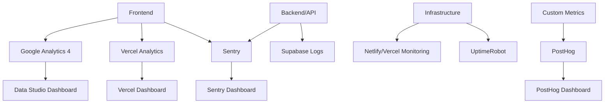

# Monitoreo y Analytics - Project Lens

Esta guía documenta las herramientas y estrategias de monitoreo, analytics y observabilidad para Project Lens.

## 📋 Índice

- [Estrategia de Monitoreo](#estrategia-de-monitoreo)
- [Analytics de Usuario](#analytics-de-usuario)
- [Monitoreo de Performance](#monitoreo-de-performance)
- [Error Tracking](#error-tracking)
- [Uptime Monitoring](#uptime-monitoring)
- [Logs y Debugging](#logs-y-debugging)
- [Alertas y Notificaciones](#alertas-y-notificaciones)
- [Dashboards](#dashboards)

## 🎯 Estrategia de Monitoreo

### Objetivos

- **Experiencia de Usuario**: Monitorear Core Web Vitals y métricas de UX
- **Disponibilidad**: Asegurar 99.9% uptime
- **Performance**: Mantener tiempos de carga < 3 segundos
- **Errores**: Detectar y resolver errores rápidamente
- **Negocio**: Trackear conversiones y engagement

### Stack de Monitoreo



## 📊 Analytics de Usuario

### Google Analytics 4

#### Configuración

```typescript
// lib/analytics.ts
import { GoogleAnalytics } from '@next/third-parties/google'

export const GA_TRACKING_ID = process.env.NEXT_PUBLIC_GA_ID

// Eventos personalizados
export const trackEvent = (
  action: string,
  category: string,
  label?: string,
  value?: number
) => {
  if (typeof window !== 'undefined' && window.gtag) {
    window.gtag('event', action, {
      event_category: category,
      event_label: label,
      value: value,
    })
  }
}

// Eventos específicos del negocio
export const trackProfileView = (username: string, role: string) => {
  trackEvent('profile_view', 'engagement', `${role}:${username}`)
}

export const trackContactSent = (senderRole: string, receiverRole: string) => {
  trackEvent('contact_sent', 'conversion', `${senderRole}_to_${receiverRole}`)
}

export const trackSearch = (query: string, filters: any, resultsCount: number) => {
  trackEvent('search', 'engagement', query, resultsCount)
}
```

#### Implementación en Componentes

```typescript
// components/features/ProfileCard.tsx
import { trackProfileView } from '@/lib/analytics'

export const ProfileCard = ({ profile }: ProfileCardProps) => {
  const handleProfileClick = () => {
    trackProfileView(profile.username, profile.role)
    // Navigate to profile
  }

  return (
    <div onClick={handleProfileClick}>
      {/* Profile card content */}
    </div>
  )
}
```

#### Eventos Clave a Trackear

```typescript
// Eventos de conversión
- user_registration
- profile_completion
- contact_sent
- message_replied

// Eventos de engagement
- profile_view
- search_performed
- portfolio_image_viewed
- filter_applied

// Eventos de performance
- page_load_time
- image_load_time
- search_response_time
```

### PostHog (Product Analytics)

```typescript
// lib/posthog.ts
import posthog from 'posthog-js'

if (typeof window !== 'undefined') {
  posthog.init(process.env.NEXT_PUBLIC_POSTHOG_KEY!, {
    api_host: process.env.NEXT_PUBLIC_POSTHOG_HOST || 'https://app.posthog.com',
    loaded: (posthog) => {
      if (process.env.NODE_ENV === 'development') posthog.debug()
    }
  })
}

// Feature flags
export const useFeatureFlag = (flag: string) => {
  return posthog.isFeatureEnabled(flag)
}

// Cohort analysis
export const identifyUser = (userId: string, properties: any) => {
  posthog.identify(userId, properties)
}

// Funnel tracking
export const trackFunnelStep = (step: string, properties?: any) => {
  posthog.capture(`funnel_${step}`, properties)
}
```

## ⚡ Monitoreo de Performance

### Core Web Vitals

```typescript
// lib/webVitals.ts
import { getCLS, getFID, getFCP, getLCP, getTTFB } from 'web-vitals'

const vitalsUrl = 'https://vitals.vercel-analytics.com/v1/vitals'

function getConnectionSpeed() {
  return 'connection' in navigator &&
    navigator.connection &&
    'effectiveType' in navigator.connection
    ? navigator.connection.effectiveType
    : ''
}

function sendToAnalytics(metric: any) {
  const body = JSON.stringify({
    dsn: process.env.NEXT_PUBLIC_VERCEL_ANALYTICS_ID,
    id: metric.id,
    page: window.location.pathname,
    href: window.location.href,
    event_name: metric.name,
    value: metric.value.toString(),
    speed: getConnectionSpeed(),
  })

  if (navigator.sendBeacon) {
    navigator.sendBeacon(vitalsUrl, body)
  } else {
    fetch(vitalsUrl, {
      body,
      method: 'POST',
      keepalive: true,
    })
  }
}

export function reportWebVitals() {
  getCLS(sendToAnalytics)
  getFID(sendToAnalytics)
  getFCP(sendToAnalytics)
  getLCP(sendToAnalytics)
  getTTFB(sendToAnalytics)
}
```

### Performance Monitoring Component

```typescript
// components/PerformanceMonitor.tsx
import { useEffect } from 'react'
import { reportWebVitals } from '@/lib/webVitals'

export const PerformanceMonitor = () => {
  useEffect(() => {
    reportWebVitals()
  }, [])

  useEffect(() => {
    // Monitor route changes
    const handleRouteChange = () => {
      // Track page load time
      const loadTime = performance.now()
      trackEvent('page_load', 'performance', window.location.pathname, loadTime)
    }

    window.addEventListener('load', handleRouteChange)
    return () => window.removeEventListener('load', handleRouteChange)
  }, [])

  return null
}
```

### Lighthouse CI

```javascript
// lighthouserc.js
module.exports = {
  ci: {
    collect: {
      url: [
        'http://localhost:3000/',
        'http://localhost:3000/buscar',
        'http://localhost:3000/registro',
      ],
      startServerCommand: 'npm run start',
      numberOfRuns: 3,
    },
    assert: {
      assertions: {
        'categories:performance': ['warn', { minScore: 0.8 }],
        'categories:accessibility': ['error', { minScore: 0.9 }],
        'categories:best-practices': ['warn', { minScore: 0.8 }],
        'categories:seo': ['warn', { minScore: 0.8 }],
        'first-contentful-paint': ['warn', { maxNumericValue: 2000 }],
        'largest-contentful-paint': ['warn', { maxNumericValue: 2500 }],
        'cumulative-layout-shift': ['warn', { maxNumericValue: 0.1 }],
      },
    },
    upload: {
      target: 'temporary-public-storage',
    },
  },
}
```

## 🚨 Error Tracking

### Sentry Configuration

```typescript
// sentry.client.config.ts
import * as Sentry from '@sentry/nextjs'

Sentry.init({
  dsn: process.env.NEXT_PUBLIC_SENTRY_DSN,
  
  // Performance monitoring
  tracesSampleRate: 1.0,
  
  // Session replay
  replaysSessionSampleRate: 0.1,
  replaysOnErrorSampleRate: 1.0,
  
  // Environment
  environment: process.env.NODE_ENV,
  
  // Release tracking
  release: process.env.NEXT_PUBLIC_APP_VERSION,
  
  beforeSend(event, hint) {
    // Filter out known issues
    if (event.exception) {
      const error = hint.originalException
      if (error && error.message && error.message.includes('Non-Error promise rejection')) {
        return null
      }
    }
    return event
  },
  
  integrations: [
    new Sentry.Replay({
      maskAllText: true,
      blockAllMedia: true,
    }),
  ],
})
```

### Error Boundaries

```typescript
// components/ErrorBoundary.tsx
import * as Sentry from '@sentry/nextjs'
import { ErrorBoundary as SentryErrorBoundary } from '@sentry/react'

interface ErrorFallbackProps {
  error: Error
  resetError: () => void
}

const ErrorFallback = ({ error, resetError }: ErrorFallbackProps) => {
  return (
    <div className="min-h-screen flex items-center justify-center">
      <div className="text-center">
        <h2 className="text-2xl font-bold mb-4">Algo salió mal</h2>
        <p className="text-gray-600 mb-4">
          Ha ocurrido un error inesperado. Nuestro equipo ha sido notificado.
        </p>
        <button
          onClick={resetError}
          className="bg-primary-600 text-white px-4 py-2 rounded hover:bg-primary-700"
        >
          Intentar de nuevo
        </button>
      </div>
    </div>
  )
}

export const ErrorBoundary = ({ children }: { children: React.ReactNode }) => {
  return (
    <SentryErrorBoundary fallback={ErrorFallback} showDialog>
      {children}
    </SentryErrorBoundary>
  )
}
```

### Custom Error Logging

```typescript
// lib/errorLogger.ts
import * as Sentry from '@sentry/nextjs'

export const logError = (error: Error, context?: any) => {
  console.error('Error:', error)
  
  Sentry.withScope((scope) => {
    if (context) {
      scope.setContext('additional_info', context)
    }
    Sentry.captureException(error)
  })
}

export const logApiError = (
  endpoint: string,
  method: string,
  error: Error,
  userId?: string
) => {
  Sentry.withScope((scope) => {
    scope.setTag('api_endpoint', endpoint)
    scope.setTag('http_method', method)
    if (userId) {
      scope.setUser({ id: userId })
    }
    Sentry.captureException(error)
  })
}
```

## 🔍 Uptime Monitoring

### Health Check Endpoint

```typescript
// app/api/health/route.ts
import { NextResponse } from 'next/server'
import { createClient } from '@supabase/supabase-js'

export async function GET() {
  try {
    const startTime = Date.now()
    
    // Check database connection
    const supabase = createClient(
      process.env.NEXT_PUBLIC_SUPABASE_URL!,
      process.env.SUPABASE_SERVICE_ROLE_KEY!
    )
    
    const { data, error } = await supabase
      .from('profiles')
      .select('count')
      .limit(1)
    
    if (error) throw error
    
    const responseTime = Date.now() - startTime
    
    return NextResponse.json({
      status: 'healthy',
      timestamp: new Date().toISOString(),
      checks: {
        database: 'ok',
        response_time: `${responseTime}ms`
      },
      version: process.env.NEXT_PUBLIC_APP_VERSION || 'unknown'
    })
    
  } catch (error) {
    return NextResponse.json(
      {
        status: 'unhealthy',
        timestamp: new Date().toISOString(),
        error: error instanceof Error ? error.message : 'Unknown error'
      },
      { status: 500 }
    )
  }
}
```

### UptimeRobot Configuration

```javascript
// Configuración de monitoreo
const monitors = [
  {
    name: 'Project Lens - Homepage',
    url: 'https://projectlens.dev',
    type: 'HTTP',
    interval: 300, // 5 minutos
  },
  {
    name: 'Project Lens - API Health',
    url: 'https://projectlens.dev/api/health',
    type: 'HTTP',
    interval: 300,
    expected_status: 200,
  },
  {
    name: 'Project Lens - Search',
    url: 'https://projectlens.dev/buscar',
    type: 'HTTP',
    interval: 600, // 10 minutos
  }
]
```

## 📝 Logs y Debugging

### Structured Logging

```typescript
// lib/logger.ts
interface LogContext {
  userId?: string
  sessionId?: string
  action?: string
  metadata?: any
}

class Logger {
  private log(level: string, message: string, context?: LogContext) {
    const logEntry = {
      timestamp: new Date().toISOString(),
      level,
      message,
      ...context,
      environment: process.env.NODE_ENV,
      version: process.env.NEXT_PUBLIC_APP_VERSION,
    }
    
    if (process.env.NODE_ENV === 'development') {
      console.log(JSON.stringify(logEntry, null, 2))
    } else {
      console.log(JSON.stringify(logEntry))
    }
  }
  
  info(message: string, context?: LogContext) {
    this.log('info', message, context)
  }
  
  warn(message: string, context?: LogContext) {
    this.log('warn', message, context)
  }
  
  error(message: string, error?: Error, context?: LogContext) {
    this.log('error', message, {
      ...context,
      error: error ? {
        name: error.name,
        message: error.message,
        stack: error.stack,
      } : undefined,
    })
  }
}

export const logger = new Logger()
```

### API Request Logging

```typescript
// middleware.ts
import { NextResponse } from 'next/server'
import type { NextRequest } from 'next/server'
import { logger } from '@/lib/logger'

export function middleware(request: NextRequest) {
  const startTime = Date.now()
  
  const response = NextResponse.next()
  
  // Log API requests
  if (request.nextUrl.pathname.startsWith('/api/')) {
    const duration = Date.now() - startTime
    
    logger.info('API Request', {
      method: request.method,
      url: request.nextUrl.pathname,
      userAgent: request.headers.get('user-agent'),
      duration: `${duration}ms`,
      status: response.status,
    })
  }
  
  return response
}
```

## 🔔 Alertas y Notificaciones

### Slack Integration

```typescript
// lib/notifications.ts
interface SlackAlert {
  channel: string
  message: string
  severity: 'info' | 'warning' | 'error' | 'critical'
}

export const sendSlackAlert = async (alert: SlackAlert) => {
  if (!process.env.SLACK_WEBHOOK_URL) return
  
  const colors = {
    info: '#36a64f',
    warning: '#ff9500',
    error: '#ff0000',
    critical: '#8B0000'
  }
  
  const payload = {
    channel: alert.channel,
    attachments: [{
      color: colors[alert.severity],
      fields: [{
        title: `${alert.severity.toUpperCase()} - Project Lens`,
        value: alert.message,
        short: false
      }],
      footer: 'Project Lens Monitoring',
      ts: Math.floor(Date.now() / 1000)
    }]
  }
  
  try {
    await fetch(process.env.SLACK_WEBHOOK_URL, {
      method: 'POST',
      headers: { 'Content-Type': 'application/json' },
      body: JSON.stringify(payload)
    })
  } catch (error) {
    console.error('Failed to send Slack alert:', error)
  }
}

// Alertas automáticas
export const alertOnHighErrorRate = (errorRate: number) => {
  if (errorRate > 5) { // 5% error rate
    sendSlackAlert({
      channel: '#alerts',
      message: `High error rate detected: ${errorRate}%`,
      severity: 'critical'
    })
  }
}

export const alertOnSlowResponse = (endpoint: string, responseTime: number) => {
  if (responseTime > 5000) { // 5 seconds
    sendSlackAlert({
      channel: '#performance',
      message: `Slow response detected on ${endpoint}: ${responseTime}ms`,
      severity: 'warning'
    })
  }
}
```

### Email Alerts

```typescript
// lib/emailAlerts.ts
import { Resend } from 'resend'

const resend = new Resend(process.env.RESEND_API_KEY)

export const sendErrorAlert = async (error: Error, context: any) => {
  try {
    await resend.emails.send({
      from: 'alerts@projectlens.dev',
      to: ['dev-team@projectlens.dev'],
      subject: `🚨 Error Alert - Project Lens`,
      html: `
        <h2>Error Detected</h2>
        <p><strong>Message:</strong> ${error.message}</p>
        <p><strong>Stack:</strong></p>
        <pre>${error.stack}</pre>
        <p><strong>Context:</strong></p>
        <pre>${JSON.stringify(context, null, 2)}</pre>
        <p><strong>Time:</strong> ${new Date().toISOString()}</p>
      `
    })
  } catch (emailError) {
    console.error('Failed to send error alert email:', emailError)
  }
}
```

## 📊 Dashboards

### Custom Analytics Dashboard

```typescript
// components/AdminDashboard.tsx
import { useEffect, useState } from 'react'

interface DashboardMetrics {
  totalUsers: number
  activeUsers: number
  totalProfiles: number
  messagesLastWeek: number
  searchesLastWeek: number
  errorRate: number
  avgResponseTime: number
}

export const AdminDashboard = () => {
  const [metrics, setMetrics] = useState<DashboardMetrics | null>(null)
  
  useEffect(() => {
    const fetchMetrics = async () => {
      const response = await fetch('/api/admin/metrics')
      const data = await response.json()
      setMetrics(data)
    }
    
    fetchMetrics()
    const interval = setInterval(fetchMetrics, 60000) // Update every minute
    
    return () => clearInterval(interval)
  }, [])
  
  if (!metrics) return <div>Loading...</div>
  
  return (
    <div className="grid grid-cols-1 md:grid-cols-2 lg:grid-cols-4 gap-6">
      <MetricCard
        title="Total Users"
        value={metrics.totalUsers}
        trend="+12%"
        color="blue"
      />
      <MetricCard
        title="Active Users"
        value={metrics.activeUsers}
        trend="+8%"
        color="green"
      />
      <MetricCard
        title="Messages Sent"
        value={metrics.messagesLastWeek}
        trend="+15%"
        color="purple"
      />
      <MetricCard
        title="Error Rate"
        value={`${metrics.errorRate}%`}
        trend="-2%"
        color={metrics.errorRate > 5 ? "red" : "green"}
      />
    </div>
  )
}
```

### Metrics API

```typescript
// app/api/admin/metrics/route.ts
import { NextResponse } from 'next/server'
import { createClient } from '@supabase/supabase-js'

export async function GET() {
  try {
    const supabase = createClient(
      process.env.NEXT_PUBLIC_SUPABASE_URL!,
      process.env.SUPABASE_SERVICE_ROLE_KEY!
    )
    
    // Get user metrics
    const { count: totalUsers } = await supabase
      .from('profiles')
      .select('*', { count: 'exact', head: true })
    
    const { count: activeUsers } = await supabase
      .from('profiles')
      .select('*', { count: 'exact', head: true })
      .gte('updated_at', new Date(Date.now() - 7 * 24 * 60 * 60 * 1000).toISOString())
    
    // Get message metrics
    const { count: messagesLastWeek } = await supabase
      .from('contacts')
      .select('*', { count: 'exact', head: true })
      .gte('created_at', new Date(Date.now() - 7 * 24 * 60 * 60 * 1000).toISOString())
    
    return NextResponse.json({
      totalUsers: totalUsers || 0,
      activeUsers: activeUsers || 0,
      messagesLastWeek: messagesLastWeek || 0,
      errorRate: 2.1, // This would come from error tracking
      avgResponseTime: 450, // This would come from performance monitoring
    })
    
  } catch (error) {
    return NextResponse.json(
      { error: 'Failed to fetch metrics' },
      { status: 500 }
    )
  }
}
```

## 🔧 Configuración de Producción

### Environment Variables

```bash
# Analytics
NEXT_PUBLIC_GA_ID=G-XXXXXXXXXX
NEXT_PUBLIC_POSTHOG_KEY=phc_xxxxxxxxxx
NEXT_PUBLIC_POSTHOG_HOST=https://app.posthog.com

# Error Tracking
NEXT_PUBLIC_SENTRY_DSN=https://xxx@xxx.ingest.sentry.io/xxx
SENTRY_ORG=project-lens
SENTRY_PROJECT=frontend

# Notifications
SLACK_WEBHOOK_URL=https://hooks.slack.com/services/xxx
RESEND_API_KEY=re_xxxxxxxxxx

# Monitoring
UPTIME_ROBOT_API_KEY=ur_xxxxxxxxxx
```

### CI/CD Integration

```yaml
# .github/workflows/monitoring.yml
name: Deploy Monitoring

on:
  push:
    branches: [main]

jobs:
  deploy-monitoring:
    runs-on: ubuntu-latest
    steps:
      - uses: actions/checkout@v3
      
      - name: Setup monitoring
        run: |
          # Deploy Sentry release
          npx @sentry/cli releases new ${{ github.sha }}
          npx @sentry/cli releases set-commits ${{ github.sha }} --auto
          npx @sentry/cli releases finalize ${{ github.sha }}
          
          # Update Lighthouse CI
          npm run lighthouse:ci
          
          # Send deployment notification
          curl -X POST ${{ secrets.SLACK_WEBHOOK_URL }} \
            -H 'Content-type: application/json' \
            --data '{"text":"🚀 Project Lens deployed successfully"}'
```

---

**📊 Métricas clave**: Uptime 99.9%, Error rate < 1%, Load time < 3s  
**🔔 Alertas**: Slack + Email para errores críticos  
**📈 Dashboards**: Google Analytics, Vercel Analytics, Sentry, PostHog